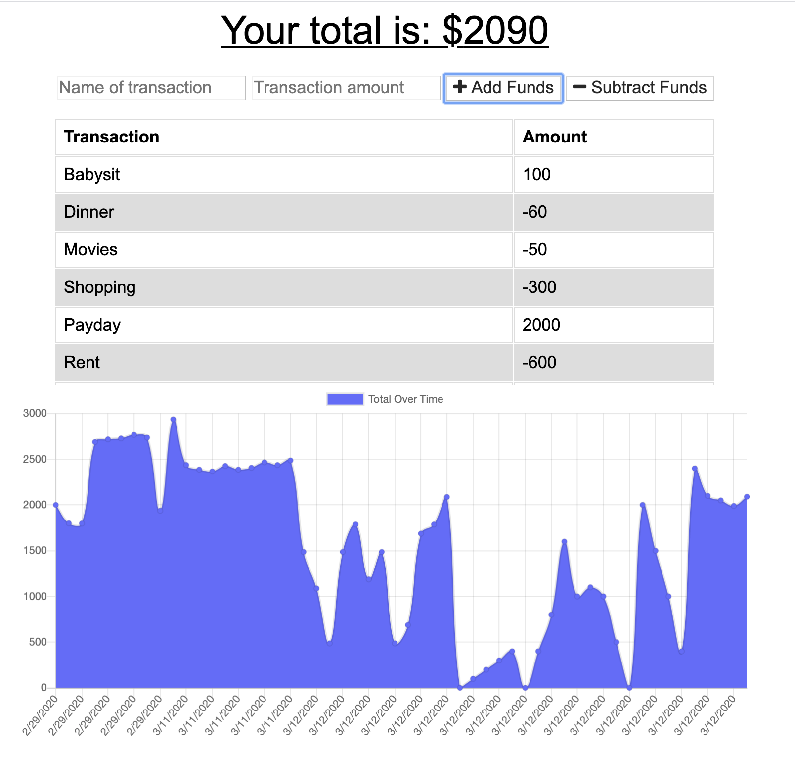

# BudgetTracker
a PWA to keep track of your budget

## Installation

Clone folder onto your own computer by forking the repository and using the "Clone or download" button on github.

Install all npm modules using the command "npm install".

Open up your MongoDB connection. 

Run the server by calling "npm start" from the root folder. 

## PWA download
Click the plus sign in the address bar to download the progressive web app to your computer or smartphone!

## Functionality
This app keeps track of a user's budget. The user can view their total amount remaining at the top, see a chart and a graph of their previous expenses, and add or subtract funds from their budget. 

## PWA
This app is a progressive web app. It can be downloaded to your computer or smartphone and be utilized when offline. 

### Offline Access
The pwa's service worker is working to make this app available to user's whether they are connected to the internet or not. All static files are stored in the cache and any get calls that are not to the transaction api are sent to the cache first. This allows for the webpage to always be seen as long as the app had previously been opened when connected to the internet. 

### Offline API Calls
The service worker also is coded to store all get calls to the transaction api. The app always attempts to make the get call to show the most current data and then store the server's response in the cache. However, if offline,the app will supply previously cached data to the user so that they can see most of their data whatever their internet service may be. 

### Offline data storage
In the case that the user is offline and attempts to add data to the budget tracker, the application has a temporary storage for offline data. Utilizing Indexed DB, a new database is opened and offline data is stored in a pending object store. Every time the page is loaded, the app checks for online status. If the user is connected to the internet and data has been stored in the pending database while the user was previously offline, the app will post all stored data to the transactions api allowing the user to save any transactions they have made while offline.  

## Coding

A large portion of this app's code was provided by triology. However this code was updated to create a progressive web app using webpack and altered to use IndexDB as a temporary data store. 

1. Webpack was used to create a bundle.js file to increase the app's performance by minimizing file size. 

2. The webpack plugin "webpack-pwa-manifest" was utilized to create the manifest.json for the app's conversion to a pwa. 

3. The app was updated to work as a pwa by also including a service worker that stores data in the cache. 

4. Indexed DB is accesed with the indexedDB.js to create a database with the "pending" object store and store pending offline data as an array of json objects that are then posted to the api once the app is back online. 

## Meta 

Jamie Kook - kookjc6@gmail.com

Github Repo: 
[https://github.com/JamieKook/BudgetTracker](https://github.com/JamieKook/BudgetTracker)

Deployed App: 
[https://aqueous-earth-88625.herokuapp.com/](https://aqueous-earth-88625.herokuapp.com/)
